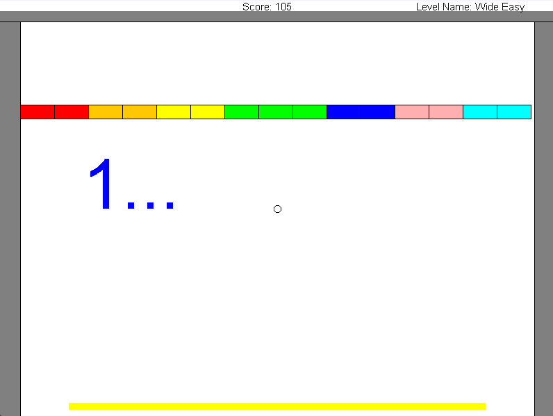
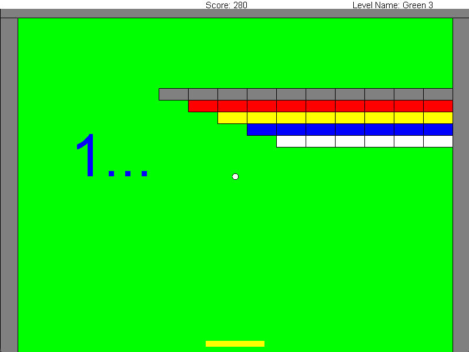

# **Arkanoid-Game**

This project was developed as part of my Object-Oriented Programming course at Bar-Ilan University. The goal was to design and implement an Arkanoid game using object-oriented principles. I used a GUI implementation that was supplied to us by the course instructors.

## **Game Description:**

This Arkanoid-like game consists of three levels, each one progressively harder than the last. The Player controls a paddle at the bottom of the screen and bouncing balls to destroy the blocks. Completing a level requires breaking all the bricks without letting the ball fall out of the screen.

## **Levels:**

### **Level 1**
A warmup level with one single block and one ball.

### **Level 2**
You have a huge paddle with many balls.

### **Level 3**
You have 2 balls and a small paddle, try and beat! (It won't be easy)

